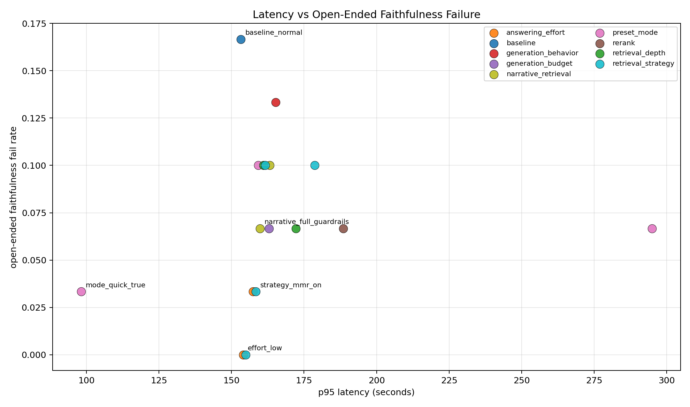
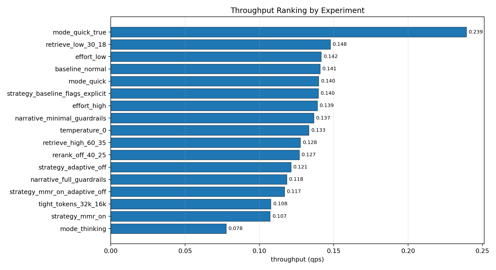
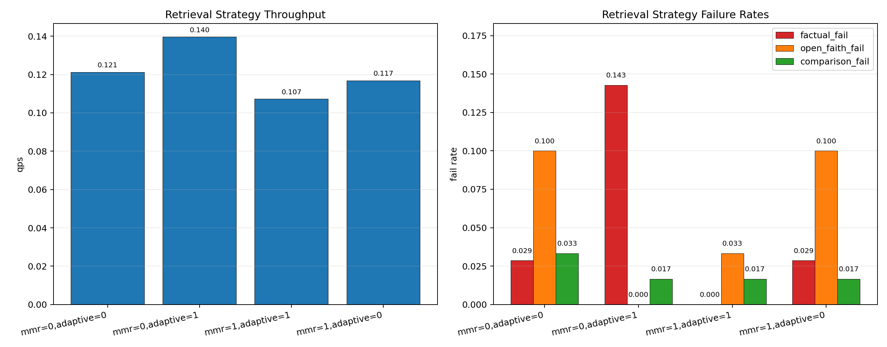
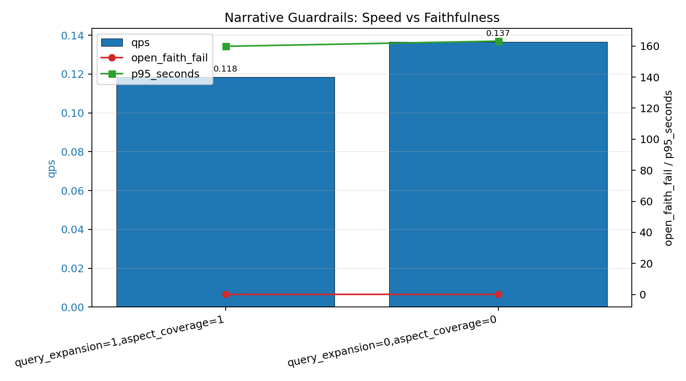
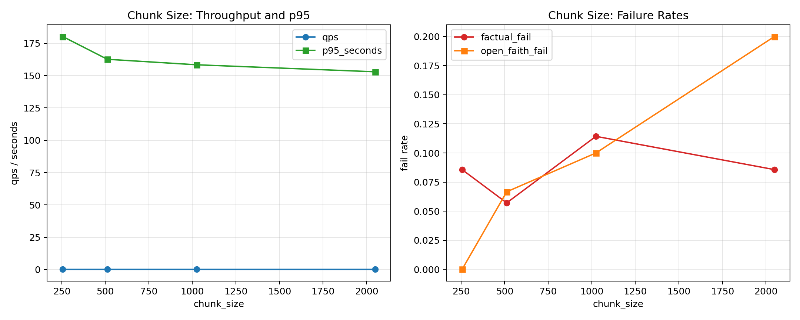
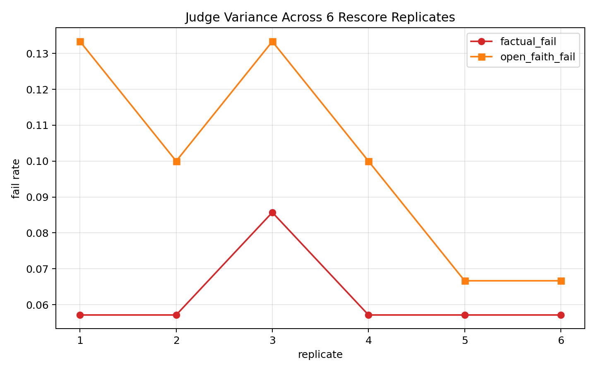

# Benchmark Report

_Last updated: 2026-02-18_

## Scope
This report consolidates the latest latency/accuracy benchmarking runs for the financial RAG pipeline.

Benchmark protocol for this report:
- Query sets: `single100` + `multi60`
- Generation: deploy-matched `normal` mode unless explicitly varied
- Tools: enabled
- Refine: disabled (`--enable-refine 0`)
- Concurrency: `12` threads
- Query timeout/retries: `350s`, `1` retry
- Judge: `12` workers, `judge_context_chars=80000`, timeout `350s`, retries `1`

Primary artifacts:
- `eval/results_revamp/latency_accuracy_frontier_20260218/frontier_manifest.csv`
- `eval/results_revamp/latency_accuracy_frontier_20260218/latency_accuracy_frontier_metrics.csv`
- `eval/results_revamp/chunk_size_study_v2_expanded80k/chunk_size_metrics_expanded80k.csv`
- `eval/results_revamp/judge_stability_single100_baseline_20260218/judge_stability_replicate_metrics.json`

## Experiment Catalog
This is the exact frontier experiment set that was executed.

| exp_id | axis | what changed | why this was run |
|---|---|---|---|
| `baseline_normal` | `baseline` | `normal` preset defaults (`40/25`, rerank on) | control run for all comparisons |
| `effort_low` | `answering_effort` | answering effort `low` | test lower synthesis effort latency/quality tradeoff |
| `effort_high` | `answering_effort` | answering effort `high` | test higher synthesis effort quality gain vs latency cost |
| `retrieve_low_30_18` | `retrieval_depth` | `top_k_retrieve=30`, `top_k_rerank=18` | test shallower retrieval budget |
| `retrieve_high_60_35` | `retrieval_depth` | `top_k_retrieve=60`, `top_k_rerank=35` | test deeper retrieval budget |
| `temperature_0` | `generation_behavior` | draft temperature `0.0` | test deterministic decoding behavior |
| `tight_tokens_32k_16k` | `generation_budget` | draft/final max tokens reduced to `32768/16384` | test tighter generation budget |
| `rerank_off_40_25` | `rerank` | reranking disabled at normal retrieval depth | isolate reranker contribution |
| `mode_quick` | `preset_mode` | quick preset (legacy run) | early quick-mode baseline |
| `mode_thinking` | `preset_mode` | thinking preset | high-effort preset tradeoff point |
| `mode_quick_true` | `preset_mode` | quick preset with corrected `--mode quick` wiring | corrected quick-mode result |
| `strategy_baseline_flags_explicit` | `retrieval_strategy` | explicit strategy flags `mmr=0, adaptive=1` | **control for strategy ablation**: same intended default strategy but explicit toggles to avoid implicit-default ambiguity |
| `strategy_mmr_on` | `retrieval_strategy` | `mmr=1, adaptive=1` | isolate effect of enabling MMR while keeping adaptive budget on |
| `strategy_adaptive_off` | `retrieval_strategy` | `mmr=0, adaptive=0` | isolate effect of disabling adaptive budget |
| `strategy_mmr_on_adaptive_off` | `retrieval_strategy` | `mmr=1, adaptive=0` | test MMR without adaptive budget |
| `narrative_full_guardrails` | `narrative_retrieval` | `query_expansion=1`, `aspect_coverage=1` | test full narrative retrieval guardrails |
| `narrative_minimal_guardrails` | `narrative_retrieval` | `query_expansion=0`, `aspect_coverage=0` | test minimal narrative overhead baseline |

## Results Summary Table
All frontier runs with core metrics.

| exp_id | axis | setting | qps | p95_ms | factual_fail | open_faith_fail | comparison_fail |
|---|---|---|---:|---:|---:|---:|---:|
| `baseline_normal` | `baseline` | `normal_default` | 0.1408 | 153175.6 | 0.0857 | 0.1667 | 0.0167 |
| `effort_low` | `answering_effort` | `low` | 0.1416 | 154107.2 | 0.0571 | 0.0000 | 0.0333 |
| `effort_high` | `answering_effort` | `high` | 0.1390 | 157353.1 | 0.0286 | 0.0333 | 0.0167 |
| `retrieve_low_30_18` | `retrieval_depth` | `top_k_retrieve=30,top_k_rerank=18` | 0.1477 | 160977.7 | 0.0571 | 0.1000 | 0.0167 |
| `retrieve_high_60_35` | `retrieval_depth` | `top_k_retrieve=60,top_k_rerank=35` | 0.1276 | 172178.0 | 0.1714 | 0.0667 | 0.0167 |
| `temperature_0` | `generation_behavior` | `draft_temperature=0.0` | 0.1333 | 165182.1 | 0.0286 | 0.1333 | 0.0167 |
| `tight_tokens_32k_16k` | `generation_budget` | `draft_max_tokens=32768,final_max_tokens=16384` | 0.1077 | 162894.1 | 0.0857 | 0.0667 | 0.0333 |
| `rerank_off_40_25` | `rerank` | `enable_rerank=0` | 0.1269 | 188579.3 | 0.0571 | 0.0667 | 0.0167 |
| `mode_quick` | `preset_mode` | `quick` | 0.1399 | 159210.6 | 0.0286 | 0.1000 | 0.0167 |
| `mode_thinking` | `preset_mode` | `thinking` | 0.0776 | 294960.7 | 0.1143 | 0.0667 | 0.0167 |
| `mode_quick_true` | `preset_mode` | `quick` | 0.2392 | 98157.3 | 0.0571 | 0.0333 | 0.0500 |
| `strategy_baseline_flags_explicit` | `retrieval_strategy` | `mmr=0,adaptive=1` | 0.1396 | 154830.0 | 0.1429 | 0.0000 | 0.0167 |
| `strategy_mmr_on` | `retrieval_strategy` | `mmr=1,adaptive=1` | 0.1072 | 158371.7 | 0.0000 | 0.0333 | 0.0167 |
| `strategy_adaptive_off` | `retrieval_strategy` | `mmr=0,adaptive=0` | 0.1213 | 178635.1 | 0.0286 | 0.1000 | 0.0333 |
| `strategy_mmr_on_adaptive_off` | `retrieval_strategy` | `mmr=1,adaptive=0` | 0.1169 | 161613.1 | 0.0286 | 0.1000 | 0.0167 |
| `narrative_full_guardrails` | `narrative_retrieval` | `query_expansion=1,aspect_coverage=1` | 0.1185 | 159802.9 | 0.0286 | 0.0667 | 0.0167 |
| `narrative_minimal_guardrails` | `narrative_retrieval` | `query_expansion=0,aspect_coverage=0` | 0.1366 | 163159.5 | 0.0286 | 0.1000 | 0.0167 |

## Topline Visuals

### Latency vs Open-Ended Faithfulness

### Throughput Ranking (Readable)

## Retrieval Strategy Ablation
Toggle axis:
- `FINRAG_ENABLE_MMR_DIVERSITY`
- `FINRAG_ENABLE_ADAPTIVE_RETRIEVAL_BUDGET`

| setting | qps | p95_ms | factual_fail | open_faith_fail | comparison_fail |
|---|---:|---:|---:|---:|---:|
| `mmr=0,adaptive=1` | 0.1396 | 154830.0 | 0.1429 | 0.0000 | 0.0167 |
| `mmr=1,adaptive=1` | 0.1072 | 158371.7 | 0.0000 | 0.0333 | 0.0167 |
| `mmr=0,adaptive=0` | 0.1213 | 178635.1 | 0.0286 | 0.1000 | 0.0333 |
| `mmr=1,adaptive=0` | 0.1169 | 161613.1 | 0.0286 | 0.1000 | 0.0167 |

Interpretation:
- `strategy_mmr_on` improved factual correctness on this dataset, with throughput cost.
- Disabling adaptive budget regressed open-faithfulness in this sweep.
- `strategy_baseline_flags_explicit` is a strict strategy-control run, not a new algorithm.

## Narrative Guardrail Ablation
Toggle axis:
- `FINRAG_ENABLE_NARRATIVE_QUERY_EXPANSION`
- `FINRAG_ENABLE_NARRATIVE_ASPECT_COVERAGE`

| setting | qps | p95_ms | factual_fail | open_faith_fail | comparison_fail |
|---|---:|---:|---:|---:|---:|
| `query_expansion=1,aspect_coverage=1` | 0.1185 | 159802.9 | 0.0286 | 0.0667 | 0.0167 |
| `query_expansion=0,aspect_coverage=0` | 0.1366 | 163159.5 | 0.0286 | 0.1000 | 0.0167 |

Interpretation:
- Full narrative guardrails improved open-ended faithfulness.
- Minimal guardrails improved throughput but weakened narrative faithfulness.

## Chunk Size Ablation (Judge Context 80k)

| chunk_size | overlap | qps | p95_ms | factual_fail | open_faith_fail | comparison_fail |
|---:|---:|---:|---:|---:|---:|---:|
| 256 | 32 | 0.1321 | 180216.6 | 0.0857 | 0.0000 | 0.0333 |
| 512 | 64 | 0.1385 | 162625.8 | 0.0571 | 0.0667 | 0.0167 |
| 1024 | 128 | 0.1376 | 158374.3 | 0.1143 | 0.1000 | 0.0333 |
| 2048 | 256 | 0.1360 | 152962.3 | 0.0857 | 0.2000 | 0.0167 |

## Judge Stability (Fixed Generations)
6 independent rescoring passes on the same single100 baseline generations.

| metric | mean | stddev | min | max |
|---|---:|---:|---:|---:|
| factual_fail | 0.0619 | 0.0106 | 0.0571 | 0.0857 |
| factual_help_fail | 0.0190 | 0.0135 | 0.0000 | 0.0286 |
| open_faith_fail | 0.1000 | 0.0272 | 0.0667 | 0.1333 |
| open_help_fail | 0.0000 | 0.0000 | 0.0000 | 0.0000 |
| distractor_focus_fail | 0.0667 | 0.0000 | 0.0667 | 0.0667 |

Implication:
- open-ended faithfulness has a material judge-variance band; small deltas must be interpreted cautiously.

## Reproducibility Scripts
- `agent_logs/scripts/eval/20260218_060700_collect_latency_accuracy_frontier.py`
- `agent_logs/scripts/eval/20260218_114300_extend_latency_accuracy_frontier_mmr_adaptive.sh`
- `agent_logs/scripts/eval/20260218_115700_extend_latency_accuracy_frontier_narrative_flags.sh`
- `agent_logs/scripts/eval/20260218_113300_judge_stability_rescore_single100_baseline.sh`
- `agent_logs/scripts/eval/20260218_154300_build_benchmark_report_figures.py`
