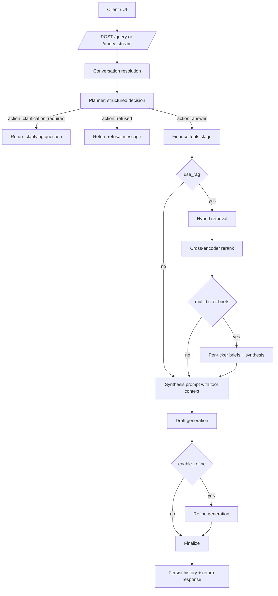
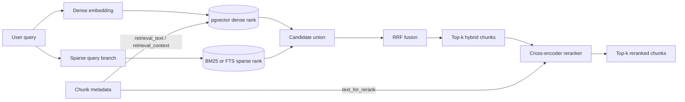
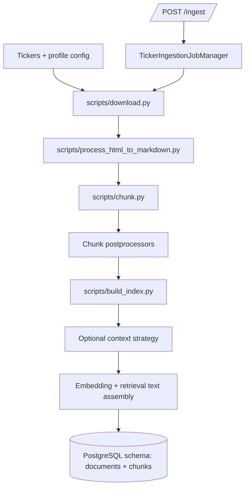
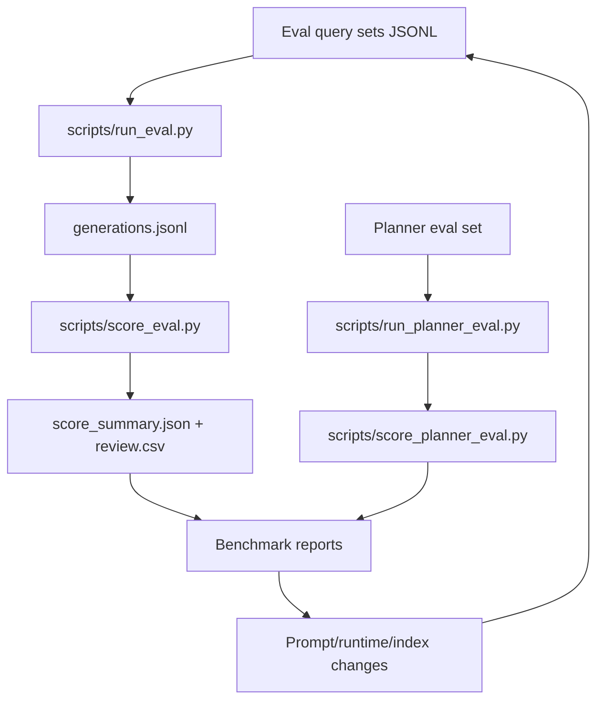

# Andromeda

Andromeda is a tools-first financial QA system over SEC filings. It combines planner-routed tool calls, hybrid retrieval, reranking, and eval-governed iteration so numeric and narrative answers are grounded in explicit evidence.

## Latest Status (as of 2026-02-20)

Recent repo changes and benchmark results to know first:

- Planner characteristics quality improved substantially in the latest planner eval run:
  - exact match `0.98`
  - macro F1 `0.9960`
  - micro F1 `0.9919`
  - see `BENCHMARK_PLANNER_v3.md`
- Planner routing failure mode was fixed (heuristic ticker-inference refusal path removed in planner-first flow), and open-ended baseline quality improved in the full-suite rerun:
  - open200 faithfulness fail `0.2764 -> 0.1200`
  - open200 helpfulness fail `0.4372 -> 0.2800`
  - see `BENCHMARK_WITH_FIXED_PLANNER_20Feb.md` and `agent_logs/LOGBOOK.md`
- Eval launcher guardrails now resolve `DOC_INDEX_PATH` from ingest profile by default and block profile/path mismatches unless explicitly overridden:
  - see `scripts/run_full_eval_suite.sh`, `scripts/_env.sh`, `CHANGELOG.md` (Unreleased)
- Retrieval benchmarking remains mixed by slice:
  - retrieval-only factual-anchor audit showed rerank regressions in chunk-level concentration (`BENCHMARK_RETRIEVAL.md`)
  - end-to-end full-suite rerun did not support globally disabling rerank (`BENCHMARK_WITH_FIXED_PLANNER_20Feb.md`)

## Architecture

### Query/Answer Pipeline



### Retrieval and Reranking Stack



### Ingestion and Indexing Pipeline



### Eval and Benchmark Loop



## Current Design (Backend)

### Planner-first orchestration

- Planner outputs:
  - `action`: `answer`, `clarification_required`, `refused`
  - `characteristics`: `comparison`, `market_data`, `financial_metrics`, `filing_narrative`
  - tool/rag routing hints (`use_rag`, `use_finance_tools`, etc.)
- Clarification vs refusal boundary is explicit and tracked in planner eval artifacts.
- Planner-first routing removed heuristic ticker-inference refusal fallback from the hot path.

Primary module:
- `src/andromeda/query/runtime.py`

### Tools-first answering

- Finance tool adapters (`yfinance`, `edgartools`) run before optional RAG.
- Tool outputs are fed into synthesis prompts and returned in structured payloads.
- Streaming path (`/query_stream`) shares the same planner/tools/retrieval pipeline with stage events.

Primary modules:
- `src/andromeda/finance_tools.py`
- `src/andromeda/query/runtime.py`
- `src/andromeda/query/streaming.py`

### Hybrid retrieval + reranking

- Retrieval backend is PostgreSQL-only (`pgvector` + sparse branch).
- Hybrid search fuses dense and sparse candidates using weighted reciprocal rank fusion.
- Reranker is a cross-encoder over retrieved candidates.
- Metadata-aware retrieval text/context is preserved through chunk export -> indexing -> reranking.

Primary modules:
- `src/andromeda/retrieval/db.py`
- `src/andromeda/retrieval/retriever.py`
- `src/andromeda/processing/metadata_models.py`
- `src/andromeda/processing/context_support.py`

### Profile-scoped ingestion/indexing

- Ingestion defaults to profile-scoped paths under `data/ingest_profiles/<profile>/...`.
- PostgreSQL schema defaults to ingest profile unless explicitly overridden.
- Eval launchers now enforce ingest-profile/doc-index consistency by default.

Primary modules/scripts:
- `src/andromeda/ingestion/ingest_profile.py`
- `scripts/download.py`, `scripts/process_html_to_markdown.py`, `scripts/chunk.py`, `scripts/build_index.py`
- `scripts/run_full_eval_suite.sh`, `scripts/_env.sh`

## API Surface

Primary endpoints in `src/andromeda/main.py`:

- `GET /health`
- `GET /generation_presets`
- `POST /query`
- `POST /query_stream`
- `POST /cancel`
- `POST /ingest`
- `GET /ingest/{job_id}`
- `GET /ingested_companies`
- `GET /source`
- `GET /source_text`
- `GET /history`
- `GET /history_entry`
- `DELETE /history`
- `GET /` (main UI)
- `GET /review` (review UI, via review router)

## Repository Map

- API wiring:
  - `src/andromeda/main.py`
- Query runtime:
  - `src/andromeda/query/runtime.py`
  - `src/andromeda/query/streaming.py`
  - `src/andromeda/query/conversation.py`
- Runtime builders/config:
  - `src/andromeda/runtime/builders.py`
- Retrieval:
  - `src/andromeda/retrieval/db.py`
  - `src/andromeda/retrieval/retriever.py`
- Prompting and LLM clients:
  - `src/andromeda/llm/qa.py`
  - `src/andromeda/llm/clients.py`
- Ingestion:
  - `src/andromeda/ingestion/*`
  - `scripts/download.py`, `scripts/process_html_to_markdown.py`, `scripts/chunk.py`, `scripts/build_index.py`
- Evaluation:
  - `src/andromeda/eval/*`
  - `scripts/run_eval.py`, `scripts/score_eval.py`
  - `scripts/run_planner_eval.py`, `scripts/score_planner_eval.py`

## Quickstart

```bash
cp .env.example .env
source .venv/bin/activate
pip install -e ".[dev]"
npm install
```

Required env examples:
- `POSTGRES_DSN` (or `DATABASE_URL`)
- chat/embed model endpoint variables (OpenAI-compatible or provider-specific)

Run app:

```bash
source .venv/bin/activate
python -m uvicorn andromeda.main:app --host 0.0.0.0 --port 8000 --reload
```

UI:
- `http://localhost:8000/`
- `http://localhost:8000/review`

## Common Workflows

Ingestion/indexing (profile-driven):

```bash
source .venv/bin/activate
bash scripts/download.sh
bash scripts/process_html_to_markdown.sh
bash scripts/chunk.sh
bash scripts/build_index.sh
```

Run full eval suite:

```bash
source .venv/bin/activate
bash scripts/run_full_eval_suite.sh
```

Run planner eval suite:

```bash
source .venv/bin/activate
bash scripts/run_planner_eval_suite.sh
```

Detailed eval runbook:
- `README_EVAL.md`

## Benchmark References

- End-to-end frontier and defaults:
  - `BENCHMARK.md`
- Retrieval/rerank subsystem deep-dive:
  - `BENCHMARK_RETRIEVAL.md`
- Reduced-heuristics full-suite run:
  - `BENCHMARK_REDUCED_HEURISTICS.md`
- Planner quality progression:
  - `BENCHMARK_PLANNER.md`
  - `BENCHMARK_PLANNER_v2.md`
  - `BENCHMARK_PLANNER_v3.md`
- Post-fix ablation rerun and coverage analysis:
  - `BENCHMARK_WITH_FIXED_PLANNER_20Feb.md`

## Known Caveat (Important)

Recent post-fix helpfulness failures are still heavily influenced by eval-query/index coverage mismatch (many prompts ask for out-of-index tickers). Treat aggregate helpfulness with an `in_index` vs `out_of_index` split when making runtime decisions.

See:
- `BENCHMARK_WITH_FIXED_PLANNER_20Feb.md`
- `agent_logs/LOGBOOK.md`
