# Andromeda

## Key features & design

Andromeda is a financial RAG assistant designed to answer investment questions with **auditable grounding** in SEC
filings. The repo is intentionally built around an “evaluation-first” loop: iterate on ingestion/retrieval/prompts, then
measure the impact end-to-end.

**Core capabilities**
- End-to-end corpus build: EDGAR download → HTML→Markdown (Marker + optional multimodal OCR) → chunking → hybrid indexing.
- Hybrid retrieval + reranking: BM25 + dense vectors (Milvus Lite or Qdrant), with optional cross-encoder reranking.
- Two-stage answering: a draft pass followed by an optional refinement pass for structure and citations.
- Streaming UX: `/query_stream` emits progress events, retrieved/reranked chunks, and token deltas; supports cancellation.
- Built-in review loop: a lightweight `/review` UI for inspecting chunks/answers, labeling failures, and exporting runs.
- Observability: OpenTelemetry spans for retrieval/rerank/LLM calls, plus local JSONL/CSV traces for regression tracking.

**Architecture at a glance**
- **Ingestion (batch)**: `scripts/download.py` → `scripts/process_html_to_markdown.py` → `scripts/chunk.py` → `scripts/build_index.py`
- **Serving (runtime)**: `src/finrag/main.py` (FastAPI) → `RAGService.answer_question()` (retrieve → rerank → draft → refine)
- **Evaluation (offline)**: `scripts/make_eval_set.py` → `scripts/run_eval.py` → `scripts/score_eval.py` (+ `/review` + `scripts/align_judge.py`)

### Architecture diagrams (Mermaid)

GitHub renders these diagrams automatically (Mermaid).

**1) Offline ingestion + indexing**

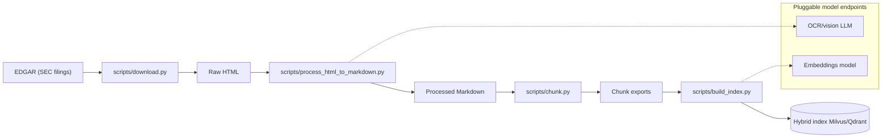

**2) Online question answering (streaming)**

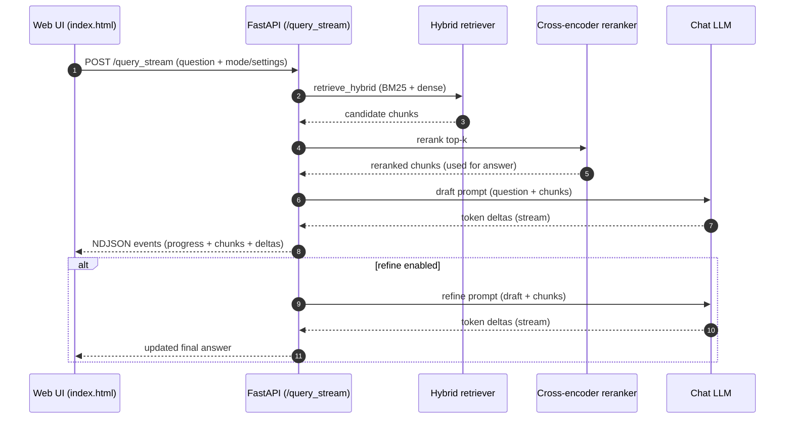

**3) Evaluation loop (generation → scoring → review → judge alignment)**

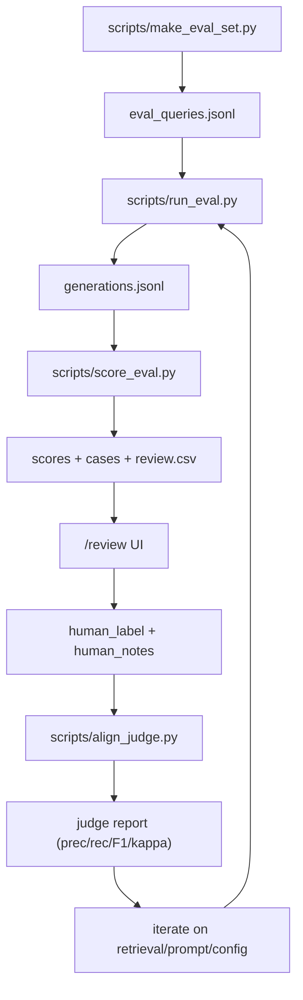

### UI screenshots

#### Q&A (streaming + citations + source viewer)

<p align="center">
  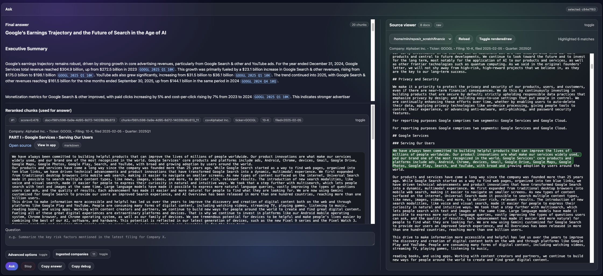
</p>
<p align="center"><em>Ask view with inline citations, the reranked chunks used for the answer, and an evidence-highlighted source viewer.</em></p>

<details>
<summary>More Q&A screenshots</summary>

<p align="center">
  
</p>
<p align="center"><em>Answer formatting example with inline citations.</em></p>

<p align="center">
  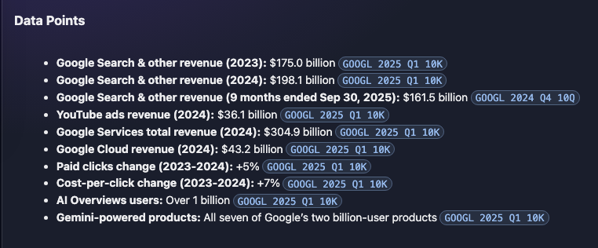
</p>
<p align="center"><em>Structured data points with citations back to filings.</em></p>

<p align="center">
  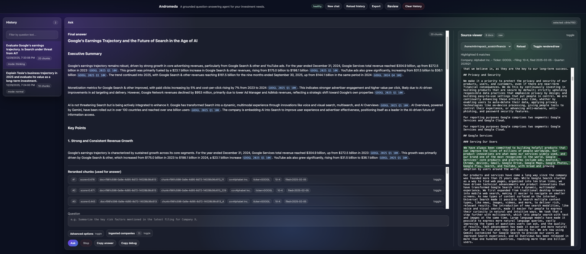
</p>
<p align="center"><em>End-to-end Q&A example with history and source browsing.</em></p>

<p align="center">
  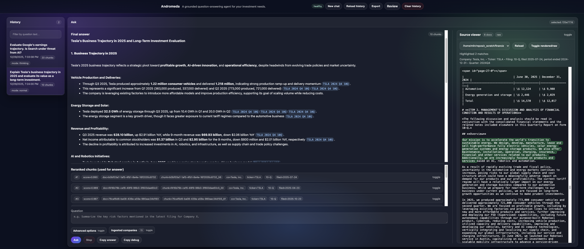
</p>
<p align="center"><em>Another end-to-end Q&A example.</em></p>
</details>

#### Eval Review (label cases, audit retrieval, inspect judge output)

<p align="center">
  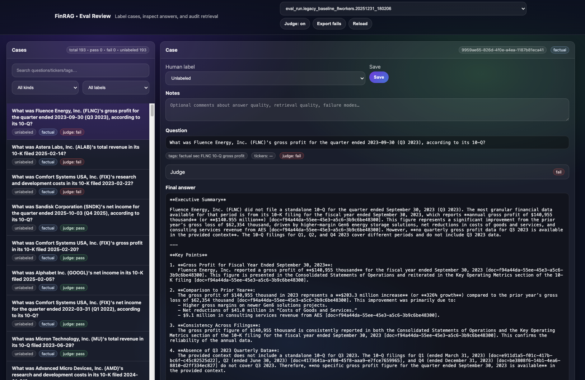
</p>
<p align="center"><em>Review UI for labeling cases and inspecting answers, retrieval, and judge outcomes.</em></p>

<details>
<summary>More Eval Review screenshots</summary>

<p align="center">
  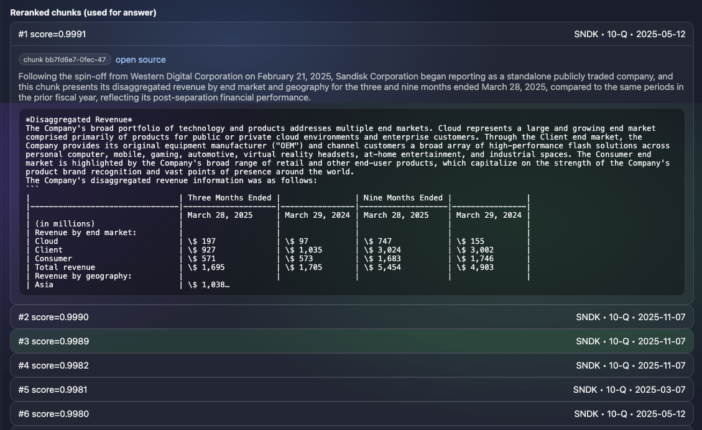
</p>
<p align="center"><em>Audit retrieval: inspect the reranked chunks actually used for the answer.</em></p>

<p align="center">
  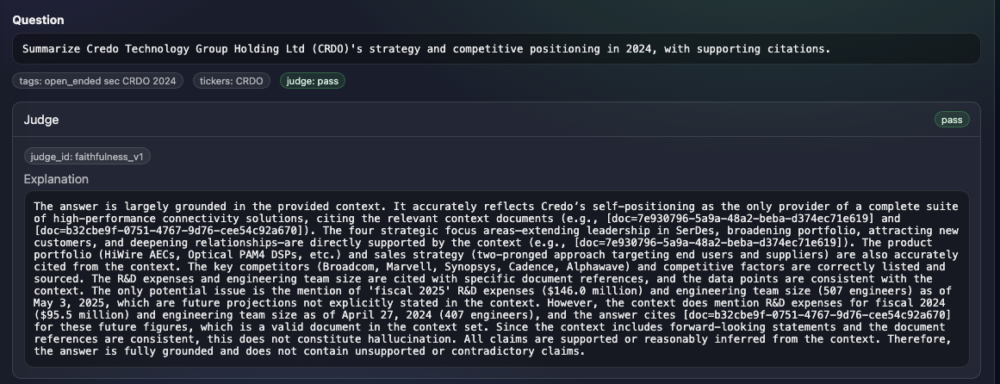
</p>
<p align="center"><em>Judge trace: automated grading decision and explanation.</em></p>

<p align="center">
  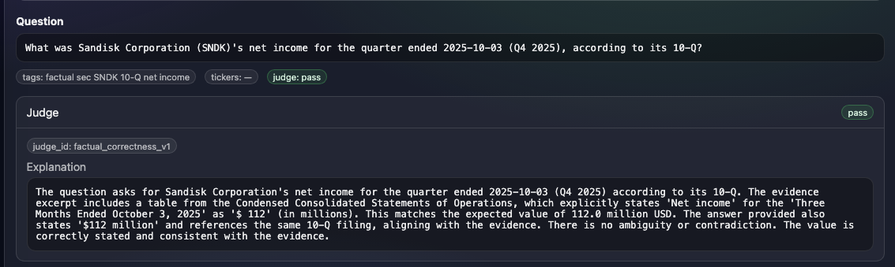
</p>
<p align="center"><em>Another judge trace example.</em></p>
</details>

### Data model (PostgreSQL revamp)

Today, Andromeda persists most state as **filesystem artifacts** (JSONL/CSV) plus **vector-store payloads** (Milvus/Qdrant).
For the planned PostgreSQL revamp, the goal is to make Postgres the **system of record** for corpus + runs, and treat
embeddings / indexes as derived.

Below is a PostgreSQL-friendly entity model that mirrors the current pipeline and makes relationships explicit.

**Design goals**
- Deterministic, joinable IDs across pipeline stages (company → filing → document → chunk).
- Preserve natural uniqueness constraints (e.g., `ticker`, `accession`) alongside stable internal IDs.
- First-class provenance: which corpus/index/run produced which artifacts.
- Support hybrid retrieval (dense + sparse) and auditability (store retrieved/reranked chunks per run).

**1) Corpus + ingestion entities (system of record)**

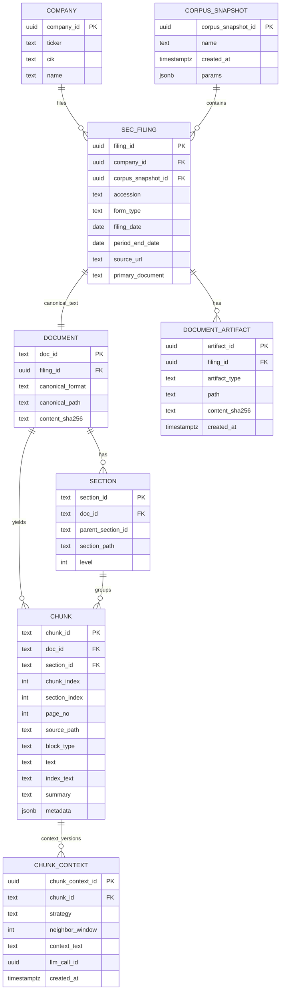

Notes (mapped to current artifacts/objects):
- `SEC_FILING` is populated from `scripts/download.py` metadata (`data/sec_filings/.../meta/*.json`) and filename conventions.
- `DOCUMENT`/`DOCUMENT_ARTIFACT` correspond to `raw_htmls/*.html`, `intermediate_pdf/*.pdf`, `processed_markdown/*.md`, and per-file `debug/*`.
- `CHUNK` corresponds to `scripts/chunk.py` outputs (`chunks/**/*.jsonl`) and `finrag.dataclasses.DocChunk`.
- `DOCUMENT.doc_id` is the join key used throughout the app (and appears in citations as `[doc=...]`), so it should be stable across re-ingestion.
- `SECTION` mirrors `SectionLinkPostprocessor` (`section_id`, `parent_section_id`, `section_path`, `section_index`).
- Chunk adjacency (e.g. `prev_chunk_id`, `next_chunk_id`, section neighbors) can be represented explicitly or derived from `chunk_index`/`section_index`.
- `CHUNK_CONTEXT` represents LLM-situated context from `apply_context_strategy()` (stored today in chunk metadata under `context`).

**2) Indexing + retrieval entities (derived, but persisted for reproducibility)**

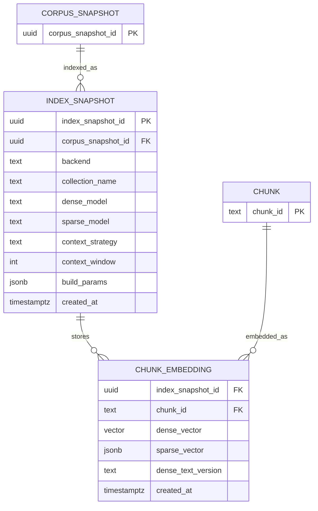

Notes:
- Today, these live in Milvus/Qdrant payloads plus sidecar files like `bm25.pkl` (see `scripts/build_index.py`).
- In Postgres, dense vectors map cleanly to `pgvector`; sparse retrieval can be implemented via `tsvector`/FTS or a BM25 extension.

**3) Answer-generation runs (audit trail)**

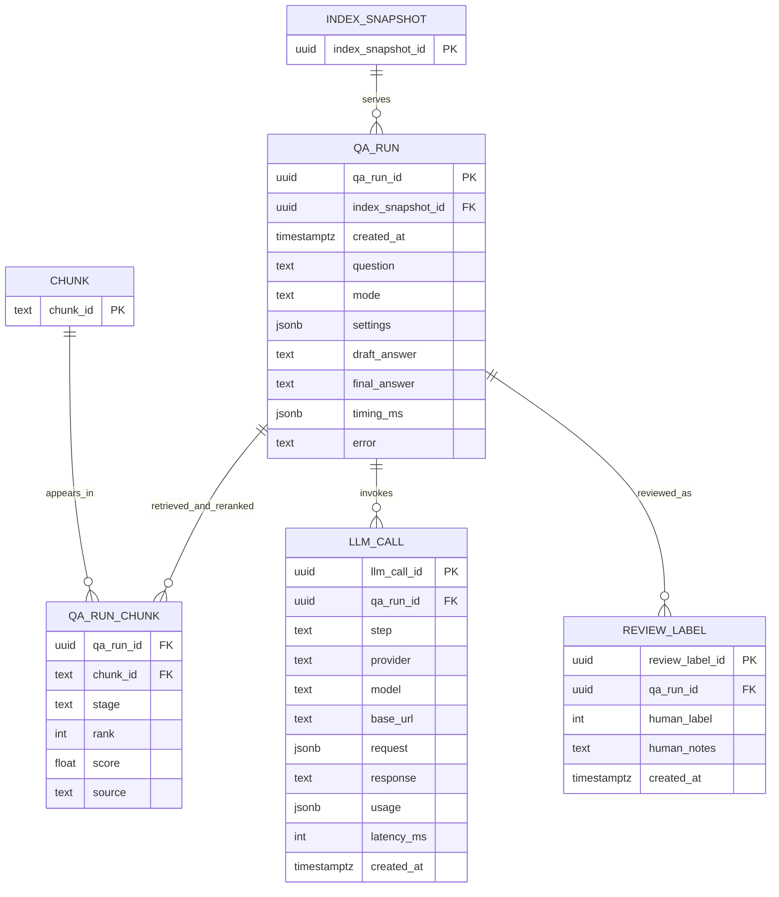

Notes:
- `QA_RUN` is what’s currently stored in `data/qa_history.jsonl` (interactive) and `logs/traces/trace_run.*/generations.jsonl` (live traces).
- `QA_RUN_CHUNK.stage` cleanly captures both `retrieved_chunks` (pre-rerank) and `top_chunks` (reranked) from the app response.

**4) Evaluation entities (dataset + scoring + judge alignment)**

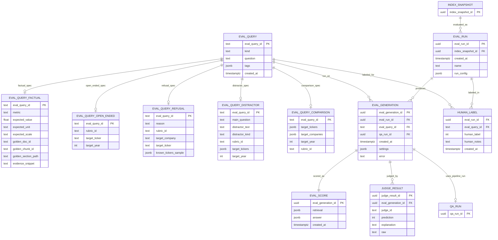

Notes:
- These map directly to `finrag.eval.schema.*` objects and on-disk eval artifacts under `eval/` + `eval/results/`.
- Exactly one `EVAL_QUERY_*` spec table row should exist per `EVAL_QUERY` based on `kind` (mirrors `EvalQuery` validation).
- Keeping `EVAL_GENERATION.qa_run_id` makes the eval harness and interactive app share one “run” representation.

## Quickstart: latest pipeline

Run everything from the repo root.

0a) Populate `.env` (see next section).

0b) Start OpenTelemetry Collector (optional, for tracing):

```bash
./scripts/serve_otelcol.sh
```

This requires an `otelcol` binary at `scripts/otelcol` (or set `OTELCOL_BIN=/path/to/otelcol`).
You can download it by following the instructions at https://opentelemetry.io/docs/collector/install/binary/linux/#manual-linux-installation.
Here is a sample command:
```bash
curl --proto '=https' --tlsv1.2 -fOL https://github.com/open-telemetry/opentelemetry-collector-releases/releases/download/v0.141.0/otelcol_0.141.0_linux_amd64.tar.gz
tar -xvf otelcol_0.141.0_linux_amd64.tar.gz
```

0c) Start vLLM (used for OCR / multimodal calls during HTML -> Markdown, and optionally for contextualization/chat):

```bash
./scripts/serve_vllm.sh
```

Then run the ingestion pipeline in order:

```bash
./scripts/download.sh
./scripts/process_html_to_markdown.sh
./scripts/chunk.sh
./scripts/build_index.sh
./scripts/launch_app.sh
```

Notes:
- Some `scripts/*.sh` are opinionated “example runs” and may contain machine-specific paths (notably `chunk.sh`, `build_index.sh`, `launch_app.sh`). Read on below for how you should modify these CLI args.
- Most scripts load `.env` automatically via `scripts/_env.sh`.

## Configuration (.env)

Put secrets and local configuration in a project root `.env` file (gitignored). Start from:

```bash
cp .env.example .env
```

### `.env` pointers

This repo uses three different “OpenAI-compatible base URLs” for different stages:

- `OPENAI_BASE_URL`: used only by `scripts/process_html_to_markdown.py` (Marker OCR + LLM processors).
- `OPENAI_CHAT_BASE_URL`: used by the app at runtime for chat completions.
- `OPENAI_EMBED_BASE_URL`: used when embeddings are generated via an OpenAI-compatible server (optional; you can also embed locally with `--milvus-dense-embedding bge-m3`).

If you’re using local vLLM, the OpenAI Python SDK still requires an API key to be set. Use:

- `OPENAI_API_KEY=test` (and keep `VLLM_API_KEY=test`, or change both to match).

Minimum set for the “latest pipeline” using `serve_vllm.sh` defaults:

```bash
# HTML -> Markdown (Marker + OCR LLM)
OPENAI_BASE_URL="http://localhost:8993/v1"
OPENAI_API_KEY="test"

# Indexing + app (if using OpenAI-compatible endpoints)
LLM_PROVIDER="openai"
OPENAI_CHAT_BASE_URL="http://localhost:8993/v1"
OPENAI_CONTEXT_BASE_URL="http://localhost:8993/v1"
# OPENAI_EMBED_BASE_URL="http://localhost:8913/v1"  # only needed if embeddings are served remotely
```

Optional (recommended if you’re debugging performance/cost):

- `LANGSMITH_TRACING=true` + `LANGSMITH_API_KEY=...` (LangSmith traces for OpenAI provider calls)
- `SECTIONHEADER_OPENAI_BASE_URL=...` (route `LLMSectionHeaderProcessor` calls to a different endpoint)

## Pipeline details + CLI args

### 1) Download SEC filings (`scripts/download.py`)

`scripts/download.py` downloads EDGAR filings into a local folder:

- `<output-dir>/raw_htmls/*.html` (raw primary documents)
- `<output-dir>/meta/*.json` (ticker, CIK, filing date, accession, source URL, etc.)

Run the repo’s example script:

```bash
./scripts/download.sh
```

Or run the CLI directly:

```bash
python3 scripts/download.py --tickers NVDA AAPL --output-dir ./data/sec_filings --per-company 5 --skip-existing
```

Common args to leave default vs change:
- `--tickers`: change (which companies to fetch).
- `--output-dir`: usually keep `./data/sec_filings`.
- `--per-company`: change to control dataset size/time.
- `--delay`: keep default unless you need to throttle harder.
- `--skip-existing`: recommended for iterative runs.

### 2) HTML -> Markdown (`scripts/process_html_to_markdown.py`)

Converts SEC filing HTML to PDFs and then to Markdown via Marker (optionally using an OpenAI-compatible multimodal LLM).

Example run (repo defaults):

```bash
./scripts/process_html_to_markdown.sh
```

Key inputs/outputs:
- Input: `--html-dir` (usually `./data/sec_filings/raw_htmls/`)
- Output root: `--output-dir` (creates `intermediate_pdf/`, `processed_markdown/`, `debug/`)

#### What happens under the hood (Marker pipeline)

`scripts/process_html_to_markdown.py` wraps Marker’s PDF pipeline:

- **HTML → PDF (WeasyPrint)**: renders a paginated PDF using SEC-friendly CSS (page breaks, multi-page tables). It can optionally strip the common repeated “Table of Contents” backlink artifact and re-render.
- **PDF → Marker Document**: `PdfConverter.build_document()` creates a `Document` (pages + blocks) via layout/line/OCR builders, then runs a processor chain (heuristics + optional LLM rewrites).
- **Document → Markdown**: `MarkdownRenderer` converts block HTML to Markdown and emits per-page metadata (used for debugging).

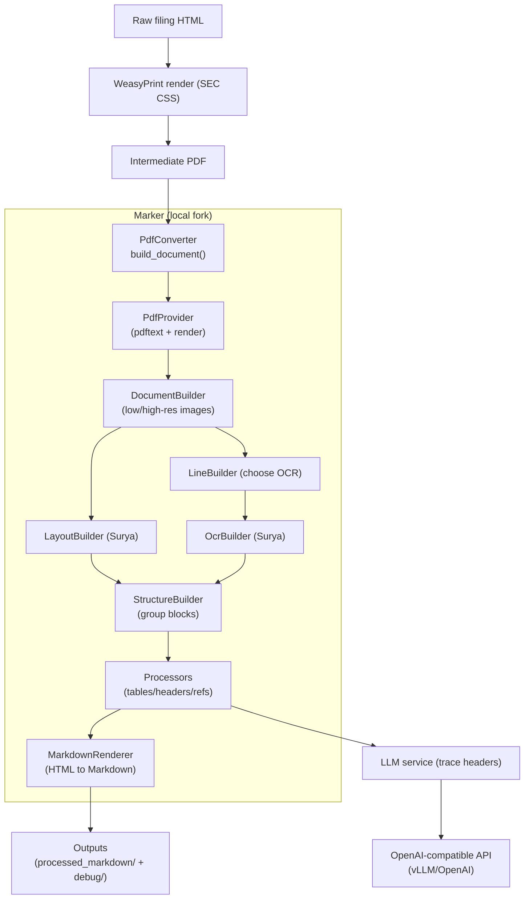

Notable Marker LLM steps for SEC filings:
- `LLMTableProcessor`: runs after `TableProcessor` (cell grid + initial HTML), then corrects table HTML from table images (chunks long tables by rows; can re-run low-confidence chunks). `--analysis-style deep` often improves corrections on noisy OCR.
- `LLMSectionHeaderProcessor`: runs after `SectionHeaderProcessor` (find candidate headers), then corrects heading levels (optionally chunks by token count and injects neighbor text + recent-header context). You can route these calls to a different endpoint via `SECTIONHEADER_OPENAI_BASE_URL`.
- `LLMPageCorrectionProcessor`: optional final per-page reorder/rewrite pass for stubborn layout/OCR issues.

Args you’ll most often change:
- `--openai-model`: the multimodal model name exposed by your OpenAI-compatible server (e.g. vLLM).
- `--year-cutoff`: filter to recent filings (based on `..._YYYY-MM-DD.html` filename suffix).
- `--workers` and `--max-concurrency`: throughput controls (effective in-flight LLM calls ≈ `workers * max_concurrency`).
- `--timeout` / `--max-retries`: reliability controls for long OCR calls.
- `--drop-front-pages` / `--drop-back-pages`: set `-1` for SEC auto-detect, otherwise a fixed number.

Args you can usually leave alone:
- `--disable-forms` and `--disable-table-merge`: both default to disabled (faster, and prevents marker from messing things up)
- `--log-prompt-token-count` + `--token-count-hf-model-id`: use if you want to monitor token pressure.

Required env vars for this step:
- `OPENAI_BASE_URL` (endpoint for Marker’s OpenAI-compatible calls)
- `OPENAI_API_KEY` (can be `test` for local vLLM)

### 3) Chunk Markdown (`scripts/chunk.py`)

Turns `processed_markdown/*.md` into chunk exports on disk (for later indexing).

Repo example script (may need path edits):

```bash
./scripts/chunk.sh
```

Portable CLI example:

```bash
python3 -m scripts.chunk \
  --markdown-dir ./data/sec_filings_md_v5/processed_markdown \
  --output-dir ./data/sec_filings_md_v5/chunked_1024_128 \
  --max-tokens 1024 \
  --overlap-tokens 128 \
  --recursive
```

Args you’ll most often change:
- `--markdown-dir` / `--output-dir`: match your step (2) output.
- `--max-tokens` / `--overlap-tokens`: controls chunk size (bigger chunks = fewer vectors, smaller chunks = more recall).

### 4) Build index (`scripts/build_index.py`)

Embeds and upserts chunks into a local Milvus (Milvus Lite) DB file by default, or into Qdrant/Milvus server if configured.

Repo example script (may need path/URL edits):

```bash
./scripts/build_index.sh
```

Portable Milvus Lite example (local dense embeddings, no embedding server needed):

```bash
python3 -m scripts.build_index \
  --ingest-output-dir ./data/sec_filings_md_v5/chunked_1024_128 \
  --collection-name finrag_chunks \
  --retriever-backend milvus \
  --milvus-sparse bm25 \
  --milvus-dense-embedding bge-m3
```

Args you’ll most often change:
- `--ingest-output-dir`: the chunk output dir from step (3).
- `--collection-name`: must match what the app uses later (`MILVUS_COLLECTION_NAME`).
- `--retriever-backend`: `milvus` (default) or `qdrant` (requires `--qdrant-storage-path` or `QDRANT_STORAGE_PATH`).
- `--milvus-uri`: optional override; can be a local file path (Milvus Lite) or an `http[s]://` URL (Milvus server).
- `--overwrite-collection`: destructive; use only when you want a clean rebuild.
- `--expand-collection`: incremental; useful when adding new docs (works best with stable chunk IDs).

When using a remote embedding endpoint (OpenAI-compatible, e.g. vLLM running an embedding model):
- Keep `--milvus-dense-embedding llm` (default) and set `--llm-provider openai`.
- Provide `--dense-model ...` + `--dense-base-url ...` (the repo’s `build_index.sh` reads this from `OPENAI_EMBED_BASE_URL`).

Optional (advanced) contextual embeddings:
- `--context neighbors` + `--context-window N` will generate “situated context” via chat calls before embedding.
- This requires a chat-capable provider via `--contextual-llm-provider/--contextual-base-url` (or env).

### 5) Launch app (`scripts/launch_app.sh`)

Starts a dev FastAPI server (Uvicorn) that serves retrieval + QA.

```bash
./scripts/launch_app.sh
```

Make sure these match your indexing run:
- `MILVUS_COLLECTION_NAME`: the same `--collection-name` used in step (4).
- `MILVUS_PATH` + `BM25_PATH`: where step (4) wrote the Milvus Lite DB and BM25 params (or where you configured them).

Live traces (for quality monitoring):
- Enabled by default. Disable with `FINRAG_TRACES_ENABLED=false`.
- Written under `./logs/traces/trace_run.YYYYMMDD/` as `generations.jsonl` + `review.csv`.
- Browse/label in the review UI at `http://localhost:8236/review` (select the `trace_run.*` directory); use “Export fails” to download labeled failures.

---

## Evaluation: product-style evals

This repo includes a product-style eval workflow inspired by:
- Label a small dataset of real input/output pairs (binary pass/fail).
- Align LLM-as-a-judge against those human labels (one judge per dimension).
- Re-run the same harness after each retrieval/prompt/config change.

### What gets measured (current)

Deterministic metrics (available with `--no-judge`):
- **Retrieval (all)**: `retrieved_chunks`, `retrieved_docs_unique`, `retrieved_tickers_unique` (+ `retrieved_tickers_top` for quick inspection)
- **Retrieval (factual)**: `gold_chunk_rank`, `gold_doc_rank`, `gold_chunk_mrr`, `gold_doc_mrr`
- **Retrieval (comparison)**: `comparison_target_tickers`, `comparison_retrieved_tickers_unique`, `comparison_all_targets_retrieved`
- **Answer (factual)**: `numeric_matched`, `numeric_best_rel_error`, `numeric_best_pred`, `cited_doc_ids`, `cited_gold_doc`
- **Robustness / behavior**:
  - `refused_heuristic` (refusal-like phrasing detector for out-of-scope prompts)
  - `mentions_target_ticker` (distractor questions: does the answer mention the intended ticker?)
  - `mentions_all_target_tickers` (comparison answers: does the response mention each requested ticker?)

LLM-as-a-judge metrics (optional; `prediction: 0=pass, 1=fail`):
- `factual_correctness_v1` (factual numeric correctness vs expected + evidence excerpt)
- `faithfulness_v1` (groundedness / hallucination check for open-ended answers)
- `refusal_v1` (refusal appropriateness for out-of-scope / prompt-injection queries)
- `focus_v1` (stay focused on the main question in distractor cases)
- `comparison_v1` (balanced multi-company comparison)

Run artifacts:
- `scores.jsonl`: per-case metric dicts (`retrieval`, `answer`, `judges`)
- `score_summary.json`: copy/paste-friendly aggregates (hit rates, accuracies, judge fail rates)
- `review.csv`: spreadsheet-friendly view + `human_label`/`human_notes`
- `cases.jsonl`: merged query + generation + score (easy for ad-hoc analysis)

### 1) Generate eval queries (JSONL)

```bash
python3 scripts/make_eval_set.py \
  --ingest-output-dir ./data/sec_filings_md_v5/chunked_1024_128 \
  --out ./eval/eval_queries.jsonl \
  --max-docs 200 \
  --n-factual 50 \
  --n-open-ended 50 \
  --n-refusal 30 \
  --n-distractor 30 \
  --n-comparison 30
```

Each JSONL line is a `finrag.eval.schema.EvalQuery`:
- `kind="factual"`: includes `expected_numeric` + a single “golden” chunk (`golden_evidence`) for retrieval + answer checks.
  * Note that the golden chunk is likely not unique: multiple chunks in the same (or different) filings can contain the same fact (e.g. EPS for a specific quarter).
  * Note also that scale units (e.g. thousands vs millions vs billions) are not always reliably parseable from raw text with simple rules.
- `kind="open_ended"`: no ground truth; intended for human labeling + judge alignment.
- `kind="refusal"`: out-of-scope / missing-context queries; the system should refuse/decline rather than hallucinate.
- `kind="distractor"`: valid investment questions with distracting user context; the system should stay focused on the main question.
- `kind="comparison"`: multi-company comparison questions; retrieval and answering should cover all mentioned companies.

### 2) Run the eval (generation)

This runs the same `RAGService.answer_question()` pipeline used by the app and stores retrieved chunks + answers.

NOTE: please export the same environment variables as `scripts/launch_app.sh`.

```bash
# NOTE: export any required env vars per scripts/launch_app.sh on top of .env
python3 -m scripts.run_eval \
  --eval-queries ./eval/eval_queries.jsonl \
  --out-dir ./eval/results \
  --index-dir ./data/sec_filings_md_v5/chunked_1024_128 \
  --mode normal \
  --concurrency 8
```

This creates a new run directory under `--out-dir` with:
- `eval_queries.jsonl` (copied)
- `generations.jsonl` (one record per query)
- `run_config.json` + `generation_summary.json`

### 3) Score the run (retrieval + answers + LLM judge)

```bash
python3 -m scripts.score_eval \
  --run-dir ./eval/results/eval_run.<...> \
  --judge-workers 8
```

See `scripts/score_eval.sh` for a complete example.

This writes `scores.jsonl`, `cases.jsonl` (merged records), `review.csv`, and `score_summary.json` into the run dir.

If you want to skip LLM-as-a-judge and only compute deterministic metrics:

```bash
python3 -m scripts.score_eval --run-dir ./eval/results/eval_run.<...> --no-judge
```

### 4) Human labels + judge alignment (open-ended)

1) Label cases in `review.csv` (writes `human_label` + `human_notes`):

- If you're already running the app via `scripts/launch_app.sh`, open `http://localhost:8236/review` and select your run.
- Or launch a lightweight review-only server:

```bash
bash scripts/launch_review.sh
```

Then open `http://localhost:8236/review`.

Set:
- `human_label`: `0` = pass, `1` = fail
- `human_notes`: optional comments

Tip: re-running `scripts/score_eval.py` preserves existing `human_label`/`human_notes` values.

2) Evaluate how well the judge matches your labels on a **dev** split (use this to iteratively tune the judge prompt):

```bash
python3 -m scripts.align_judge --run-dir ./eval/results/eval_run.<...> --judge faithfulness_v1
```

When you're done tuning, run one final time with `--eval-test` to score the held-out test split:

```bash
python3 -m scripts.align_judge --run-dir ./eval/results/eval_run.<...> --judge faithfulness_v1 --eval-test
```

`scripts/align_judge.py` reports agreement metrics against your `human_label` values, including confusion matrix counts
(`tp/fp/tn/fn`), `precision_fail`, `recall_fail`, `f1_fail`, and `cohen_kappa` (treating **fail** as the positive class).
