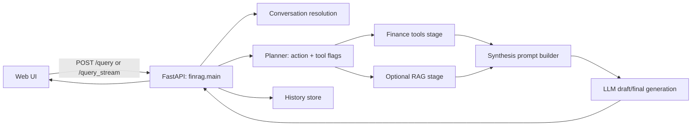
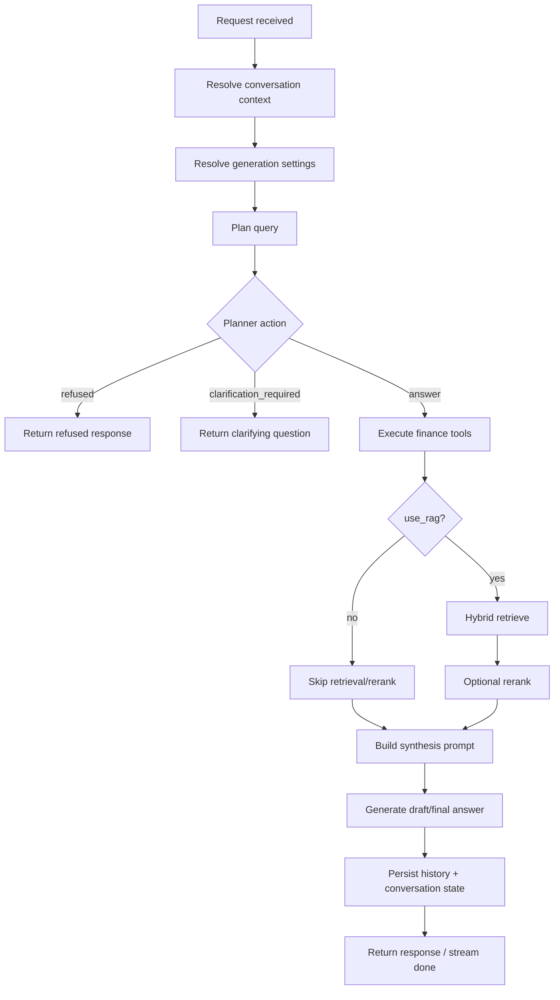
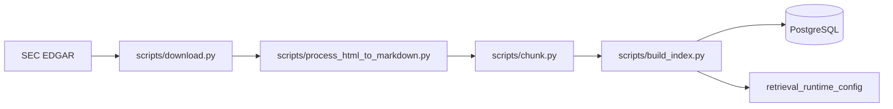
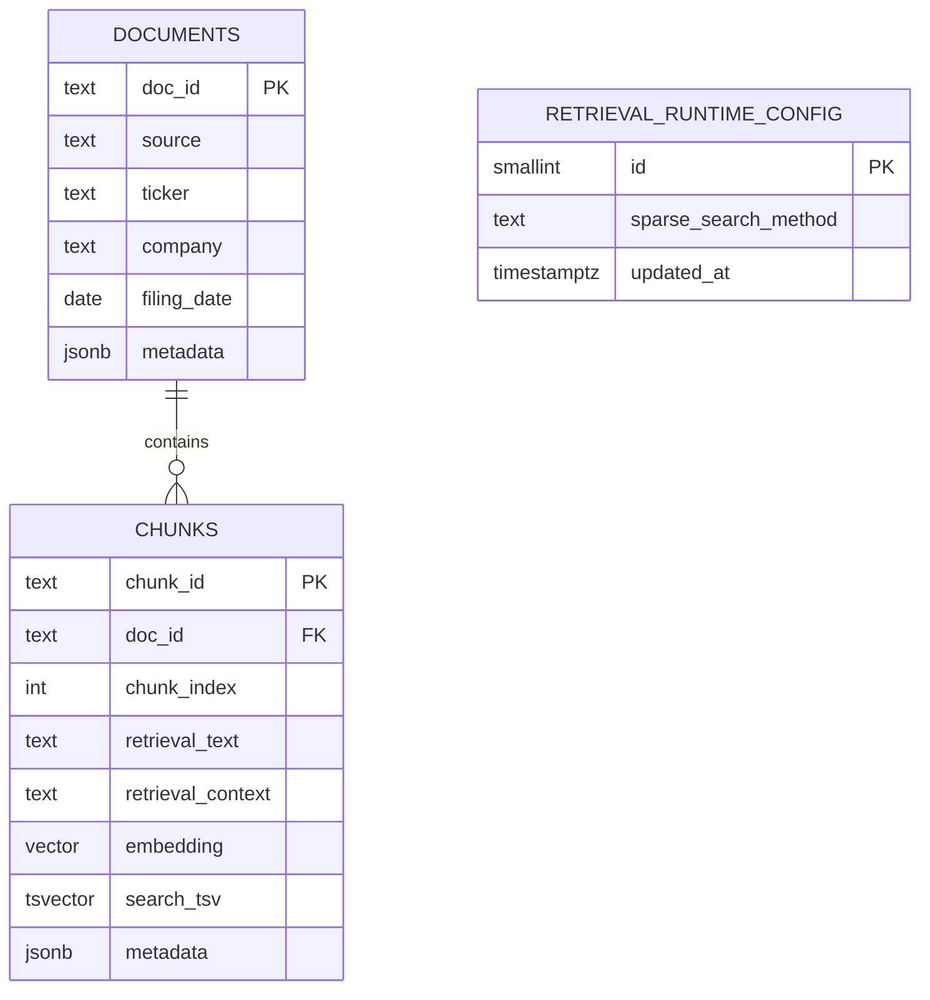

# Andromeda

Andromeda is a financial question-answering system grounded in SEC filings, with a tools-first runtime that can combine retrieval-augmented generation (RAG), market data tools, and SEC financial statement tools in a single answer pipeline.

## What this system does

- Answers filing-grounded questions over an indexed SEC corpus.
- Uses a planner to decide whether to:
  - run RAG retrieval,
  - call finance tools (`yfinance`, `edgar`),
  - or do both.
- Streams execution stages and partial output to the UI.
- Supports conversation-aware follow-ups with clarification/refusal handling.
- Supports profile-scoped ingestion and schema-scoped indexing for reproducible experiments.

## System architecture

### High-level runtime



1. UI sends `/query` or `/query_stream`.
2. Planner produces a structured decision:
   - action: `answer`, `clarification_required`, `refused`
   - tool flags: `use_rag`, `use_yfinance`, `use_edgar_financials`
3. Runtime executes tools-first pipeline:
   - finance tools (optional)
   - retrieval/rerank (optional, controlled by `use_rag`)
   - answer synthesis over tool context + retrieved chunks
4. API returns:
   - final answer
   - chunk citations
   - structured `tool_results`
   - `tool_trace` decision/execution log

### Core backend modules

- `src/finrag/main.py`
  - FastAPI wiring, endpoints, stream cancellation, history hooks.
- `src/finrag/query_runtime.py`
  - Planner schema, tools-first pipeline execution, response assembly.
- `src/finrag/query_streaming.py`
  - NDJSON stream orchestration and stage event emission.
- `src/finrag/finance_tools.py`
  - Typed adapters for `yfinance` and `edgar` tool calls.
- `src/finrag/retriever.py`, `src/finrag/db.py`
  - PostgreSQL hybrid retrieval (`pgvector` + sparse search) and corpus persistence.
- `src/finrag/runtime_builders.py`
  - Environment/profile-driven runtime construction.

## Tools-first query lifecycle

### Planner outputs

Planner decisions are strongly typed and include:

- `action`: `answer | clarification_required | refused`
- `tickers`, `filing_date_from`, `filing_date_to`
- `use_per_ticker_retrieval`
- `use_rag`, `use_yfinance`, `use_edgar_financials`

When planner output is malformed, runtime falls back to deterministic ticker inference.

### Execution order

For `action=answer`, the runtime executes:

1. `plan`
2. `finance tools`
3. `retrieve` (only if `use_rag=true`)
4. `rerank` (if enabled by generation settings)
5. `draft/final` synthesis

This enables tool-only answers for direct metric/market queries and mixed evidence answers for narrative filing questions.

### App logic flow (`/query` and `/query_stream`)



### Streaming contract (`/query_stream`)

The stream emits NDJSON events such as:

- `start`
- `status` (`plan`, `tools`, `retrieve`, `rerank`, `draft`, `final`)
- `tool_results`
- `retrieved`
- `reranked`
- `draft_delta`, `final_delta`
- `draft_done`
- `done`
- `cancelled`
- `error`

## Data model and retrieval

### PostgreSQL schema

The corpus is intentionally minimal:

- `documents`
  - filing-level metadata (`ticker`, `filing_date`, etc.)
- `chunks`
  - chunk text, metadata, vector embedding, generated `search_tsv`
- `retrieval_runtime_config`
  - schema-level sparse-method compatibility guard

### Retrieval strategy

`PostgresHybridRetriever` performs weighted reciprocal-rank fusion over:

- dense rank: `embedding <=> query_vector` (pgvector)
- sparse rank:
  - BM25 via `pg_textsearch` (default), or
  - PostgreSQL FTS (`ts_rank_cd`)

Pre-ranking filters:

- `tickers`
- `filing_date_from`
- `filing_date_to`

For multi-ticker comparisons, runtime supports per-ticker retrieval fan-out + merge + ticker-coverage-aware rerank post-processing.

### Sparse-method compatibility safety

Indexing stores the sparse method (`bm25` or `fts`) in `retrieval_runtime_config`.
Retrieval/indexing fail fast on method mismatch to prevent silent quality regressions.

## Finance tool integration

`src/finrag/finance_tools.py` normalizes tool outputs into typed results:

- `yfinance_get_ticker_info`
- `yfinance_get_ticker_news`
- `yfinance_get_price_history`
- `edgar_get_financial_metrics`
- `edgar_get_quarterly_financial_metrics`
- `edgar_get_financial_statements`

Each result includes:

- `tool`
- `ticker`
- `status`: `ok | no_data | error`
- `summary`
- `payload` (bounded/normalized)

Tool outputs are exposed in API responses (`QueryResponse.tool_results`) and rendered in a dedicated UI panel.

## Ingestion and indexing

### Pipeline



The ingestion/indexing pipeline is:

1. `scripts/download.py`
2. `scripts/process_html_to_markdown.py`
3. `scripts/chunk.py`
4. `scripts/build_index.py`

Shell wrappers (`*.sh`) default to profile-scoped artifact paths under `data/ingest_profiles/<profile>/...`.

### On-the-fly ticker ingestion

Backend jobs (`/ingest`, `/ingest/{job_id}`) run the same pipeline in background threads via `src/finrag/ingestion_jobs.py`, using persisted profile settings when available.

## API surface (primary endpoints)

- `GET /health`
- `GET /generation_presets`
- `POST /query`
- `POST /query_stream`
- `POST /cancel`
- `POST /ingest`
- `GET /ingest/{job_id}`
- `GET /ingested_companies`
- `GET /source`
- `GET /source_text`
- `GET /history`
- `GET /history_entry`
- `DELETE /history`

## Local development

Run from repository root.

### 1) Environment

```bash
cp .env.example .env
```

Set at minimum:

- `POSTGRES_DSN` (or `DATABASE_URL`)
- `OPENAI_API_KEY` (or provider-specific key)
- model/base-url settings for your runtime

Recommended for experiment isolation:

- `POSTGRES_SCHEMA`
- `POSTGRES_SPARSE_SEARCH_METHOD`

### 2) Python/Node setup

```bash
source .venv/bin/activate
pip install -e ".[dev]"
npm install
```

### 3) Build index

```bash
bash scripts/download.sh
bash scripts/process_html_to_markdown.sh
bash scripts/chunk.sh
bash scripts/build_index.sh
```

### 4) Launch app

```bash
bash scripts/launch_app.sh
```

Default UI routes:

- `http://localhost:8236/` (Q&A)
- `http://localhost:8236/review` (evaluation review)

## Testing and quality gates

Python:

```bash
source .venv/bin/activate
pre-commit run --all
pytest -vvv tests/
```

Frontend:

```bash
npm run -s test:unit
npm run -s test:ui
```

## Design decisions and tradeoffs

- Tools-first orchestration improves flexibility: tool-only, RAG-only, or mixed answers per query.
- PostgreSQL-first storage/retrieval keeps operational footprint compact and reproducible.
- Profile + schema scoping makes experiments safer on shared databases.
- Strict sparse-method compatibility checks prioritize correctness over silent fallback behavior.
- Modular runtime separation (`main` wiring vs. query/runtime services) reduces endpoint complexity and improves testability.

## PostgreSQL data model


