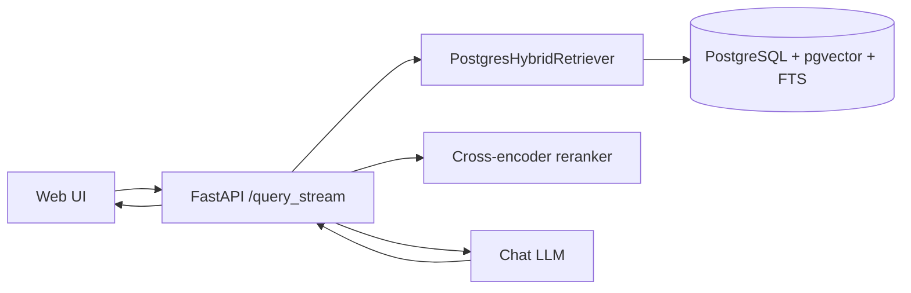
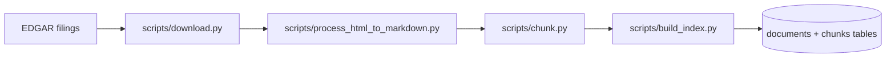
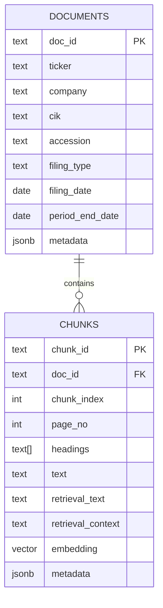

# Andromeda

Andromeda is a financial RAG assistant for SEC filings.
This codebase is now **PostgreSQL-first**:
- PostgreSQL is the source of truth for corpus data.
- PostgreSQL also handles hybrid retrieval (`pgvector` + full text search).
- Retrieval supports native pre-filtering by ticker/date to reduce false positives.

This rewrite intentionally removed backend sprawl:
- Removed Qdrant support.
- Removed Milvus support.
- Removed app-level OpenTelemetry/tracing modules.

Backward compatibility with old vector artifacts is not a goal. Rebuild the corpus/index from source files.

## Architecture

### Core runtime flow



### Ingestion/indexing flow



## Data model (concise relational schema)

The refactor uses a minimal schema to keep joins simple and code maintainable.

### `documents`
- one row per canonical filing document
- key metadata used for filtering (`ticker`, `filing_date`, etc.)

### `chunks`
- one row per chunk
- dense vector in `embedding` (`pgvector`)
- lexical text in `retrieval_text` (indexed with generated `tsvector`)
- optional `retrieval_context` for contextual embeddings



## Retrieval model

`PostgresHybridRetriever` combines:
- dense ranking: cosine distance on `embedding`
- sparse ranking: PostgreSQL FTS on `retrieval_text`
- fusion: weighted reciprocal-rank fusion (RRF)
- ANN index strategy: HNSW (pgvector)

Optional retrieval filters are applied before ranking:
- `tickers`
- `filing_date_from`
- `filing_date_to`

## Naming cleanup: `retrieval_text` and `retrieval_context`

Old code overloaded `index_text` and `context`.
The rewrite makes fields explicit:
- `retrieval_text`: text used for lexical retrieval and UI/source inspection
- `retrieval_context`: optional LLM-situated context
- embedding input is derived as:
  - `retrieval_text`
  - or `f"Context:\n{retrieval_context}\n\nChunk:\n{retrieval_text}"`

Database bootstrap includes a safety migration:
- `chunks.index_text -> chunks.retrieval_text`
- `chunks.context -> chunks.retrieval_context`

## Quickstart

Run commands from the repository root.

### 0) Environment

```bash
cp .env.example .env
```

Fill at least:
- `POSTGRES_DSN` (or `DATABASE_URL`)
- `OPENAI_API_KEY`
- model endpoint base URLs

### 1) Start PostgreSQL (lightweight local option)

```bash
docker run --name andromeda-pg \
  -e POSTGRES_PASSWORD=postgres \
  -e POSTGRES_DB=andromeda \
  -p 5432:5432 \
  -d pgvector/pgvector:pg16
```

### 2) Ingestion + index build

```bash
./scripts/download.sh
./scripts/process_html_to_markdown.sh
./scripts/chunk.sh
./scripts/build_index.sh
```

### 3) Start app

```bash
./scripts/launch_app.sh
```

Open:
- Q&A: `http://localhost:8236/`
- Eval review UI: `http://localhost:8236/review`

## UI notes

### Q&A UI (`/`)
- Refreshed, cleaner non-purple visual theme with improved spacing/contrast.
- Progress panel now shows a per-step pipeline (`retrieve`, `rerank`, `draft`, `final`) plus a live event feed.
- History entries persist and display timing data (`timing_ms`) so step durations survive reloads.

### Review UI (`/review`)
- Refreshed visual theme aligned with the main Q&A UI.
- Case details include a dedicated "Generation timings" block when `generation.timing_ms` is available.

## Key scripts

- `scripts/process_html_to_markdown.py`
  - parses SEC filing HTML directly with `sec-parser` (no PDF/OCR roundtrip)
  - emits normalized markdown to `processed_markdown/`
  - writes per-file debug metadata to `debug/<filing>/metadata.json`

- `scripts/chunk.py`
  - default chunker is `markdown_table_preserving` to keep whole tables and heading sections
  - optional `docling_hybrid` chunker is still available for tokenizer-aware chunking

- `scripts/build_index.py`
  - reads chunk exports and upserts into PostgreSQL
  - supports context strategies (`none`, `document`, `neighbors`, `metadata`)
  - ANN is HNSW-only with optional tuning via `--ann-hnsw-m` and `--ann-hnsw-ef-construction`
  - supports `--reset-corpus` (`--truncate` alias), `--recreate-ann-index`, and `--skip-existing-chunks`

- `scripts/run_eval.py`
  - runs eval queries through `RAGService.answer_question()`
  - writes `generations.jsonl`, `generation_summary.json`, `run_config.json`

- `scripts/inspect_collection.py`
  - inspects indexed chunks directly in PostgreSQL
  - supports chunk/ticker/date filters

## API filter support

`/query` and `/query_stream` accept:
- `tickers: list[str]`
- `filing_date_from: YYYY-MM-DD`
- `filing_date_to: YYYY-MM-DD`

These filters are enforced in SQL before dense/sparse candidate generation.

## Evaluation workflow

```bash
python3 scripts/make_eval_set.py \
  --ingest-output-dir ./data/sec_filings_md_v5/chunked_1024_128 \
  --out ./eval/eval_queries.jsonl

python3 -m scripts.run_eval \
  --eval-queries ./eval/eval_queries.jsonl \
  --out-dir ./eval/results \
  --mode normal \
  --concurrency 8

python3 -m scripts.score_eval --run-dir ./eval/results/eval_run.<...>
```

Review labels:
- run app or `bash scripts/launch_review.sh`
- open `http://localhost:8236/review`

## Breaking changes summary

- Qdrant removed.
- Milvus removed.
- App-level OpenTelemetry/tracing modules removed.
- Env vars like `RETRIEVER_BACKEND`, `MILVUS_*`, `QDRANT_*`, `FINRAG_OTEL_*`, `FINRAG_TRACES_*` are obsolete.
- `index_text` renamed to `retrieval_text`; `context` renamed to `retrieval_context`.
